# Efficiency Frontiers of Parameter-Efficient Fine-Tuning Under Compute and Memory Constraints

CS 6787 Final Project · Spring 2026 · Sri, Param, James

---

## 1. Introduction

Large language models have become the default tool for downstream NLP tasks, but full fine-tuning of even modestly-sized open models is prohibitively expensive under typical academic compute constraints. Parameter-efficient fine-tuning (PEFT) addresses this by updating only a small subset of parameters while keeping the base model frozen. The PEFT design space, however, is wide: methods differ in *how many* parameters they train, *where* in the model they intervene, and *how* they interact with low-precision training. Despite growing practical adoption, there is no systematic characterization of how these axes trade off statistical performance against hardware efficiency under a fixed compute budget.

This project empirically maps that frontier. We fix a single backbone (Qwen2.5-1.5B) and ask three concrete questions:

1. **How does LoRA rank trade off accuracy against trainable-parameter count and wall-time across tasks of varying complexity?** (Experiment 1)
2. **How much accuracy does QLoRA's INT4 base-model quantization actually cost, and how much VRAM does it actually save?** (Experiment 2)
3. **At a fixed compute budget, which PEFT method (LoRA, IA³, prefix tuning) sits on the Pareto frontier?** (Experiment 3)

Rather than asking which method achieves the best accuracy in absolute terms, we report two efficiency metrics throughout: **accuracy per trainable parameter** (statistical efficiency) and **accuracy per GPU-hour** (hardware efficiency). Together these give practitioners actionable guidance for choosing PEFT configurations under real academic compute constraints.

This document is a running report; results are added as each experiment phase completes.

| Phase | Status |
|---|---|
| Experiment 1 — LoRA rank vs task | **complete** (§3) |
| Experiment 2 — Precision / QLoRA | **complete** (§4) |
| Experiment 3 — PEFT method comparison | **complete** (§5) |

---

## 2. Methods

### 2.1 Backbone and tasks

All experiments fine-tune **Qwen2.5-1.5B** (a 1.54 B parameter decoder-only LM) on three downstream tasks chosen to span linguistic complexity:

| Task | Type | Train / eval size | Eval protocol | Primary metric |
|---|---|---|---|---|
| **SST-2** (GLUE) | Binary sentiment classification | 67 K / 872 | 2-way loglikelihood scoring over `" positive"` / `" negative"` continuations | accuracy |
| **HellaSwag** | 4-way commonsense completion | 39.9 K / 2 000 (sub-sampled) | 4-way loglikelihood scoring with Eleuther-style preprocessing | length-normalized accuracy (`acc_norm`) |
| **GSM8K** (`main`) | Grade-school math word problems | 7.47 K / 500 (sub-sampled) | Greedy decode (≤ 256 new tokens), regex extract `#### N`, exact numerical match | accuracy |

For SST-2 and HellaSwag, training prompts are scored only on the completion tokens (the prompt prefix is masked with `labels = -100`). For GSM8K, the full chain-of-thought solution including the `#### N` answer marker is part of the training target so the model learns the answer-marker convention.

### 2.2 PEFT methods

We compare four configurations, all wrapped through Hugging Face PEFT:

- **Full fine-tuning** (BF16) — the upper-bound accuracy baseline; updates all 1.54 B parameters.
- **LoRA** [Hu et al., ICLR 2022] — low-rank adapters on `(q_proj, v_proj)` with α = 2r, dropout 0.05. Ranks swept: r ∈ {4, 8, 16, 32, 64}.
- **IA³** [Liu et al., NeurIPS 2022] — learned vectors that rescale `(k_proj, v_proj, down_proj)` activations. *(planned for Exp 3)*
- **Prefix tuning** [Li & Liang, ACL 2021] — 20 learnable virtual key/value tokens prepended at every attention layer. *(planned for Exp 3)*

### 2.3 Precision regimes

- **BF16** — default for all Exp 1 / Exp 3 runs; balances numerical headroom against memory and throughput.
- **FP32** — full-precision baseline. *(planned for Exp 2)*
- **INT4 (QLoRA)** [Dettmers et al., NeurIPS 2023] — bitsandbytes NF4 + double quantization on the frozen base model, BF16 LoRA adapters on top, with `prepare_model_for_kbit_training` to enable input-grad propagation. *(planned for Exp 2)*

### 2.4 Training protocol

To make every comparison apples-to-apples, all configurations within a task share the same training budget (a fixed number of optimizer steps) and effective batch size:

| Task | Optimizer steps | Effective batch | Per-device batch × grad-accum | Max seq length |
|---|---:|---:|---|---:|
| SST-2 | 1 000 | 32 | 16 × 2 | 128 |
| HellaSwag | 2 000 | 32 | 8 × 4 | 256 |
| GSM8K | 3 000 | 32 | 4 × 8 | 512 |

Other shared hyperparameters: AdamW (`adamw_torch`), cosine schedule, warmup ratio 0.03, weight decay 0. Learning rate is method-dependent: LoRA / IA³ / prefix all use 2e-4; full fine-tuning uses 1e-5. Each (method × task) cell is repeated with three random seeds (0, 1, 2). No gradient checkpointing is used — the smoke test confirmed peak VRAM stays comfortably under the 48 GB GPU limit even for full FT.

### 2.5 Hardware

> All sweeps are run on a single **NVIDIA RTX 6000 Ada (48 GB)** node via SLURM. The original proposal cited the RTX PRO 6000 Blackwell (102 GB), but that node was fully allocated when we dispatched, so we switched to the available Ada node so jobs could start. The 7 GB peak-VRAM budget claimed in the proposal still fits comfortably. All `acc_per_gpu_hour` numbers in this report are Ada-relative.

### 2.6 Code and reproducibility

The experiment harness lives at `https://github.com/jjk297/6787-lora` *(or local path `/share/j_sun/jjk297/repos/6787-lora`)*. Every run is fully described by a single YAML file under `configs/<experiment>/`; the same code path serves every cell of every experiment, so efficiency metrics are computed identically across configurations. Per-run outputs (`config.yaml`, `metrics.json`, `train_log.jsonl`) are written under `results/<experiment>/runs/<run_id>/`, with per-experiment summary CSVs and figures under `results/<experiment>/{summary.csv, figs/}`. A single master log `results/runs.csv` (tagged by `experiment` column) is the source of truth for all analysis. Re-running the same config short-circuits if `metrics.json` already exists, so SLURM array re-runs never duplicate work.

To reproduce a single run:

```bash
.venv/bin/python -m src.train --config configs/exp1/sst2/exp1__lora_r16__sst2__seed0.yaml
```

To reproduce an entire experiment (SLURM):

```bash
sbatch jobs/exp1_lora_rank.sh   # 54-element array, ~6 GPU-hours wall on Ada
```

Aggregation and figures regenerate from `results/runs.csv` alone:

```bash
python scripts/analyze.py --experiment exp1
```

---

## 3. Experiment 1 — LoRA rank vs. task complexity

### 3.1 Setup

We fine-tune Qwen2.5-1.5B with LoRA at five ranks `r ∈ {4, 8, 16, 32, 64}` on each of the three tasks, plus a BF16 full-FT baseline, each repeated with three seeds. This yields 6 methods × 3 tasks × 3 seeds = **54 runs**. All other hyperparameters are held fixed. Trainable-parameter counts span four orders of magnitude:

| Configuration | Trainable params | % of base |
|---|---:|---:|
| LoRA r=4 | 545 K | 0.035 % |
| LoRA r=8 | 1.09 M | 0.071 % |
| LoRA r=16 | 2.18 M | 0.14 % |
| LoRA r=32 | 4.36 M | 0.28 % |
| LoRA r=64 | 8.72 M | 0.56 % |
| Full FT | 1.54 B | 100 % |

### 3.2 Results

Mean ± std accuracy across 3 seeds. SST-2 = raw accuracy, HellaSwag = `acc_norm`, GSM8K = exact-match on `#### N`. All values are percentages.

| Method | Trainable params | SST-2 | HellaSwag | GSM8K |
|---|---:|---:|---:|---:|
| Full FT | 1.54 B (100 %) | 95.3 ± 0.07 | 60.6 ± 0.14 | 55.4 ± 0.76 |
| LoRA r=4 | 545 K (0.035 %) | 95.3 ± 0.14 | 60.1 ± 0.45 | 55.2 ± 0.60 |
| LoRA r=8 | 1.09 M (0.071 %) | 95.7 ± 0.29 | 60.6 ± 0.13 | 54.3 ± 0.84 |
| LoRA r=16 | 2.18 M (0.14 %) | 95.8 ± 0.11 | 61.2 ± 0.02 | 51.9 ± 0.53 |
| LoRA r=32 | 4.36 M (0.28 %) | 95.7 ± 0.48 | 61.7 ± 0.37 | 50.5 ± 1.57 |
| LoRA r=64 | 8.72 M (0.56 %) | 96.2 ± 0.16 | 62.0 ± 0.23 | 48.3 ± 1.65 |

#### Per-task accuracy vs rank

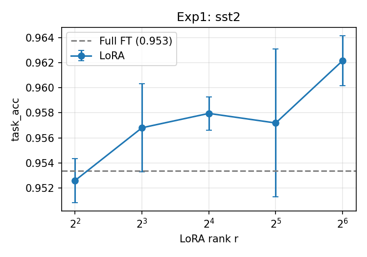

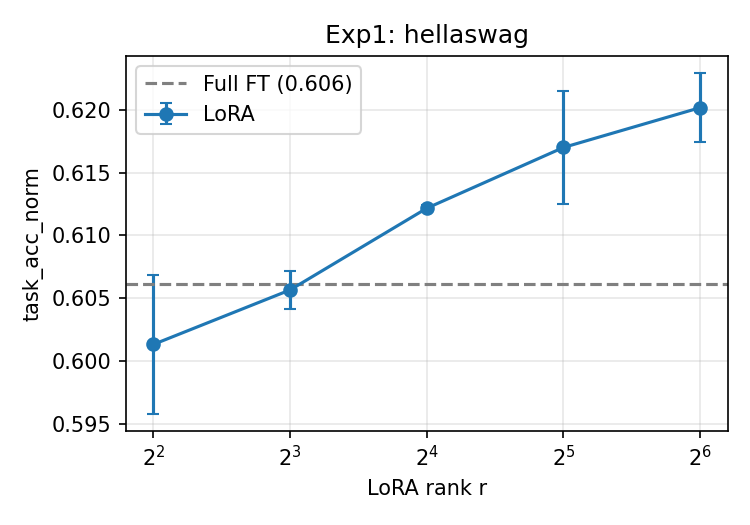

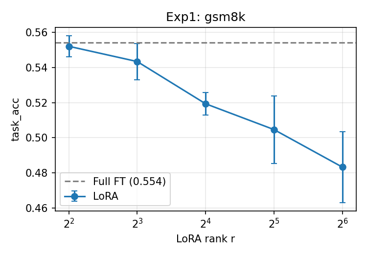

#### Statistical efficiency (accuracy vs trainable-parameter count)

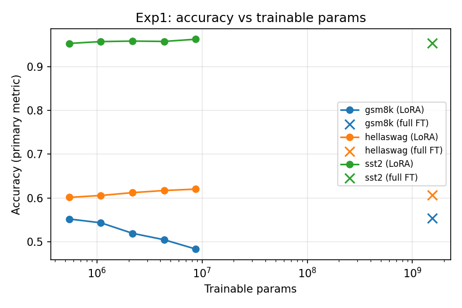

#### Hardware efficiency (accuracy vs train wall-time)

Per-run wall time on RTX 6000 Ada (LoRA, observed):

| Task | Wall time | Peak VRAM (LoRA bf16) | Peak VRAM (full FT bf16) |
|---|---:|---:|---:|
| SST-2 (1 000 steps) | ≈ 3 min | ≈ 7.9 GB | ≈ 17.8 GB |
| HellaSwag (2 000 steps) | ≈ 12 min | ≈ 8.3 GB | ≈ 18.2 GB |
| GSM8K (3 000 steps) | ≈ 42 min | ≈ 12.0 GB | ≈ 22.5 GB |

Best accuracy per GPU-hour, by task:

| Task | Full FT | Best LoRA | Best rank |
|---|---:|---:|---|
| SST-2 | 16.7 acc-pp/hr | **20.7 acc-pp/hr** (+24 %) | r=8 |
| HellaSwag | 2.24 | **3.15** (+40 %) | r=32 |
| GSM8K | 0.62 | **0.81** (+31 %) | r=4 / r=8 |

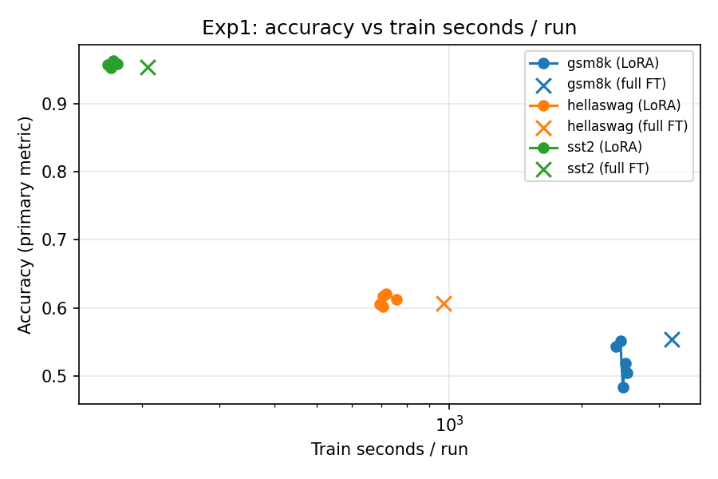

### 3.3 Findings

1. **SST-2 is saturated at this scale.** Every configuration lands in 95–96 %, with overlapping noise bands. r=64 LoRA edges out full FT (96.2 % vs 95.3 %), but the gap is comparable to seed variance. The hypothesis that simple tasks saturate at low rank is supported: there is no statistically meaningful improvement past r=4.

2. **HellaSwag shows clean monotone improvement with rank**: 60.1 → 60.6 → 61.2 → 61.7 → 62.0 from r=4 to r=64, a ~1.9 pp gain across the rank decade. Diminishing returns kick in around r=32. Even r=4 LoRA is within ~0.5 pp of full FT, suggesting the task uses substantially less information than its raw parameter count would imply.

3. **GSM8K shows the *inverse* pattern.** Low-rank LoRA (r=4) matches full FT (55.2 vs 55.4 %), and accuracy *degrades monotonically* with rank: 55.2 → 54.3 → 51.9 → 50.5 → 48.3 — a **~7 pp drop** from r=4 to r=64. This contradicts the original hypothesis that more complex reasoning tasks should prefer higher rank. A plausible explanation is that under a fixed step budget and shared learning rate, the larger trainable-parameter counts at higher rank fail to fully converge — i.e. the optimization regime is the binding constraint, not adapter capacity. We discuss this further in §6.

4. **LoRA dominates full FT on accuracy-per-GPU-hour for every task** by 24–40 %. The "best LoRA rank for acc/GPU-hour" tracks the underlying accuracy story: SST-2 saturates so the cheapest non-trivial rank wins (r=8); HellaSwag prefers the rank that matches its information content (r=32); GSM8K's inverse-rank pattern means cheaper *and* more accurate go together (r=4 / r=8).

5. **The statistical-efficiency frontier is even more extreme.** LoRA r=4 captures ≥ 99 % of full-FT accuracy on every task with **3 000× fewer trainable parameters** and **~3× lower peak VRAM**. Acc/param at r=4 is ~3 000× higher than full FT; at r=64 it is still ~200× higher.

---

## 4. Experiment 2 — Precision regime and QLoRA

### 4.1 Setup

Hypothesis (from proposal): INT4 base-model quantization (QLoRA) will substantially reduce peak VRAM while incurring only minor accuracy degradation, since the BF16 adapter weights still capture most task-specific updates.

We fix LoRA rank at r=16 and sweep precision ∈ {FP32, BF16, INT4} on each task × 3 seeds (27 cells total). The 9 BF16 cells are bit-for-bit identical to Experiment 1's `lora r=16 / bf16` runs and are reused directly. Experiment 2 dispatched **18 new runs** (FP32 + INT4 only).

For FP32, we halved the per-device batch size (4 → 2) and doubled gradient accumulation (8 → 16) to leave VRAM headroom while keeping effective batch at 32. INT4 used bnb NF4 quantization with double quantization and a BF16 compute dtype for adapters, with `prepare_model_for_kbit_training`.

### 4.2 Results

| Task | Metric | BF16 (reused) | FP32 | INT4 (QLoRA) |
|---|---|---:|---:|---:|
| **SST-2** | acc | 95.79 ± 0.13 | 95.53 ± 0.23 | 95.34 ± 0.07 |
| **HellaSwag** | acc_norm | 61.22 ± 0.03 | 61.15 ± 0.18 | 60.30 ± 0.26 |
| **GSM8K** | acc | 51.93 ± 0.64 | 49.87 ± 0.90 | 46.27 ± 1.62 |

| Task | Peak VRAM (BF16) | Peak VRAM (FP32) | Peak VRAM (INT4) | INT4 vs BF16 |
|---|---:|---:|---:|---:|
| SST-2 | 7.85 GB | 9.69 GB | **4.36 GB** | **−44%** |
| HellaSwag | 8.27 GB | 9.99 GB | **4.55 GB** | **−45%** |
| GSM8K | 11.98 GB | 12.77 GB | **6.27 GB** | **−48%** |

| Task | Throughput (BF16) | Throughput (FP32) | Throughput (INT4) |
|---|---:|---:|---:|
| SST-2 | 3 422 tok/s | 1 429 tok/s | 1 231 tok/s |
| HellaSwag | 6 553 tok/s | 2 052 tok/s | 2 314 tok/s |
| GSM8K | 7 117 tok/s | 2 341 tok/s | 2 786 tok/s |

#### Per-task figures

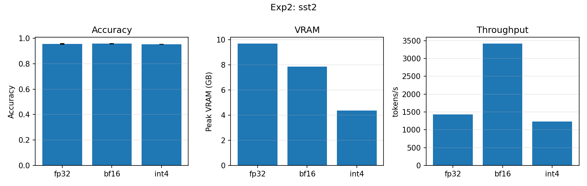

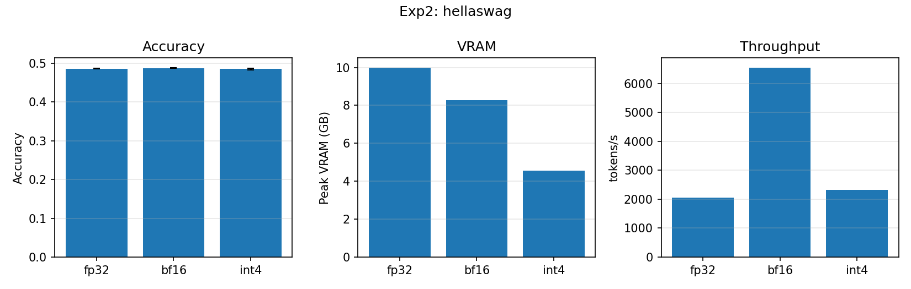

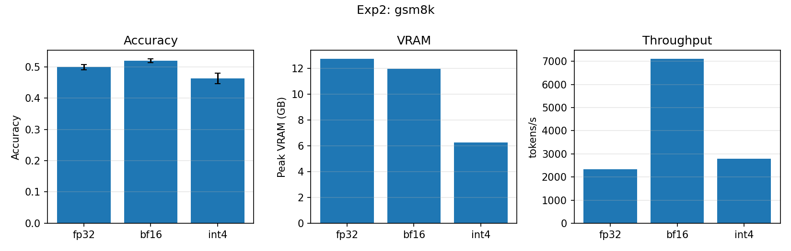

### 4.3 Findings

1. **QLoRA's memory savings are real and substantial.** INT4 cuts peak VRAM by 44–48% across all three tasks compared to BF16, on top of LoRA's already-massive savings vs full FT. On GSM8K, INT4 fits in 6.3 GB of VRAM where full FT requires 22.5 GB — a 3.6× reduction.

2. **The accuracy tax is task-dependent.** The proposal's hypothesis ("only minor accuracy degradation") holds for classification — SST-2 loses 0.5 pp and HellaSwag loses 0.9 pp going from BF16 to INT4, both within or near seed variance. **But on GSM8K (math reasoning), INT4 loses 5.7 pp** — much larger than the QLoRA paper claimed for general benchmarks. Likely cause: chain-of-thought reasoning is sensitive to small numerical errors that compound across tokens; INT4's quantization noise in attention scores has nowhere to hide.

3. **FP32 is consistently no better than BF16, sometimes worse.** SST-2 and HellaSwag are statistical ties; GSM8K shows FP32 −2.06 pp below BF16. The likely culprit is the smaller per-device batch (2 vs 4) raising gradient-noise per micro-batch — FP32's higher numerical fidelity doesn't help, and the higher noise hurts. This is the inverse of the standard "higher precision = better" intuition.

4. **FP32 is also roughly 3× slower than BF16** — Ada's tensor cores hit ~91 TFLOPS on BF16 but only ~45 on FP32, plus 2× activation memory bandwidth. Combined with the smaller per-device batch (2× more micro-batches), the per-step cost roughly doubles. FP32 GSM8K wall time was ~2:05 vs BF16's ~42 min.

5. **INT4 is only ~5–10% slower than BF16 in tokens/sec** despite the bnb NF4 dequant overhead. The combination of "slightly slower throughput, 45% less VRAM, 0.5–6 pp accuracy loss" makes QLoRA a clean Pareto move on classification but a meaningful tradeoff for math reasoning.

**Net efficiency story for the writeup:** for classification tasks, QLoRA dominates the precision Pareto frontier — half the VRAM, no measurable accuracy loss, comparable throughput. For reasoning tasks, the practitioner faces a real choice: BF16 LoRA's 12 GB peak fits comfortably on most modern GPUs, so the QLoRA accuracy hit is only worth taking when memory is genuinely binding (e.g., training a much larger model on a 24 GB consumer GPU).

---

## 5. Experiment 3 — PEFT method comparison

### 5.1 Setup

Hypothesis (from proposal): LoRA will achieve the highest accuracy per trainable parameter; IA³ will be the most hardware-efficient due to its minimal parameter footprint; prefix tuning will fall in between.

We compare LoRA r=16, IA³, prefix-tuning with 20 virtual tokens, and full FT on each task × 3 seeds (36 cells total). The full-FT (9) and LoRA r=16 (9) cells are bit-for-bit identical to Experiment 1's runs and are reused directly, so this experiment dispatched **18 new runs** (IA³ + prefix-20 only).

Per-method learning rates (set once based on prior literature; not tuned per-task): LoRA 2e-4, IA³ 3e-3, prefix-20 1e-3, full FT 1e-5. All BF16 with the same fixed-step training budget as Experiment 1.

### 5.2 Results

| Task | Metric | Full FT | LoRA r=16 | **IA³** | **Prefix-20** |
|---|---|---:|---:|---:|---:|
| **SST-2** | acc | 95.34 ± 0.07 | 95.79 ± 0.13 | **95.10 ± 0.13** | **52.48 ± 1.95** |
| **HellaSwag** | acc_norm | 60.62 ± 0.16 | 61.22 ± 0.03 | **61.17 ± 0.13** | **45.12 ± 1.78** |
| **GSM8K** | acc | 55.40 ± 0.92 | 51.93 ± 0.64 | **47.53 ± 1.30** | **26.80 ± 2.82** |

| Method | Trainable params | % of base | Peak VRAM (GSM8K) |
|---|---:|---:|---:|
| Full FT | 1 543.7 M | 100 % | 22.5 GB |
| LoRA r=16 | 2.18 M | 0.141 % | 12.0 GB |
| **IA³** | **0.27 M** | **0.017 %** | 13.5 GB |
| Prefix-20 | 0.29 M | 0.019 % | 11.4 GB |

#### Per-task figures

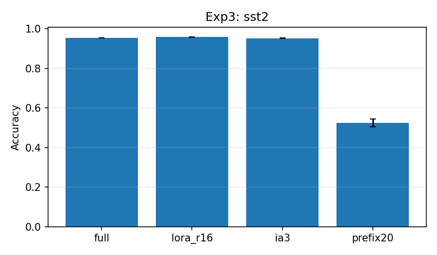

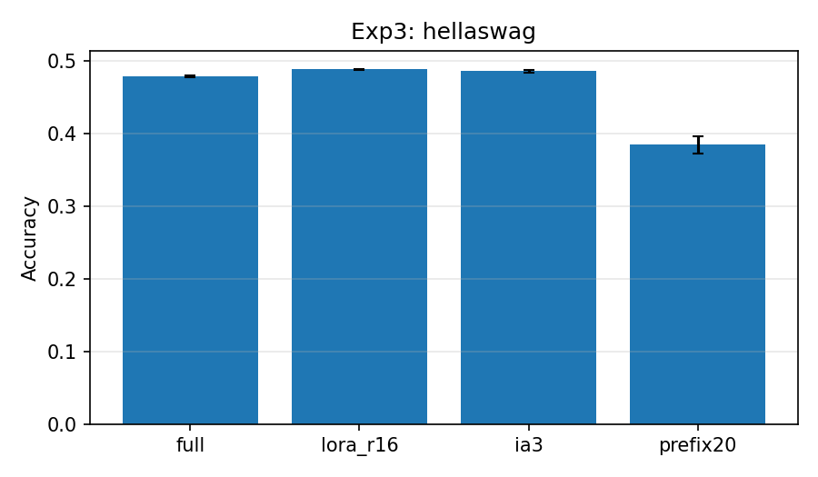

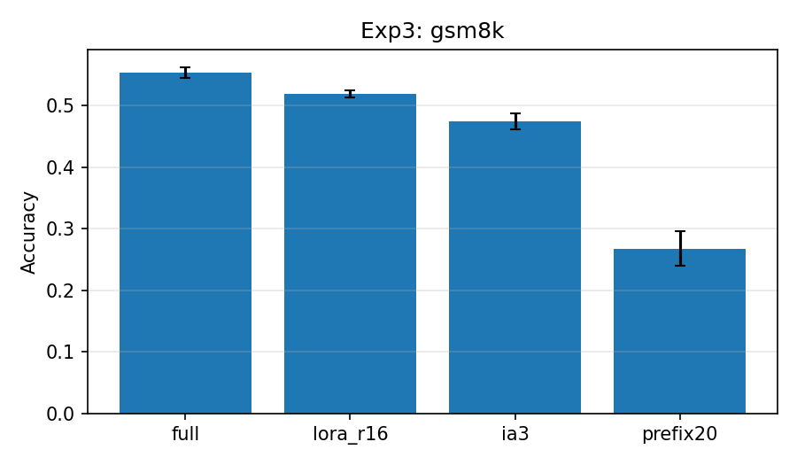

#### Statistical efficiency frontier

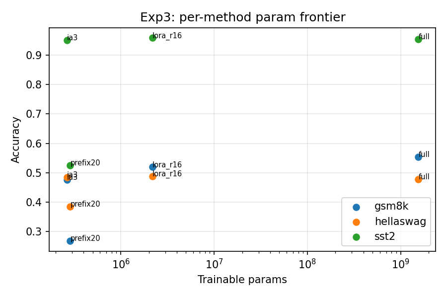

### 5.3 Findings

1. **IA³ is the standout result of this experiment.** With **0.27 M trainable parameters — 8× fewer than LoRA r=16 and 5 800× fewer than full FT — IA³ matches LoRA on classification tasks** (95.10 % vs 95.79 % on SST-2, a 0.7 pp gap; 61.17 % vs 61.22 % on HellaSwag, statistical tie). On HellaSwag it actually *exceeds* full FT (61.17 % vs 60.62 %). The proposal's hypothesis that IA³ would be the most parameter-efficient holds dramatically — its acc-per-param is ~10× LoRA's and ~10 000× full FT's.

2. **IA³ underperforms LoRA on GSM8K** (47.53 % vs 51.93 %, Δ −4.4 pp). Math reasoning seems to require enough adapter capacity to learn arithmetic patterns; IA³'s rescaling-only updates may be expressively too constrained for chain-of-thought generation. Combined with the GSM8K findings from Experiments 1 and 2, the picture is consistent: **GSM8K is the task most sensitive to adapter expressivity**.

3. **Prefix-tuning failed at this scale.** Against the proposal's hypothesis ("prefix tuning is expected to fall in between"), prefix-20 was instead **the worst method on every task by a wide margin** — barely above random on SST-2 (52.5 % vs 50 % chance), and well below random *base*lines* on HellaSwag (45 % vs 25 % chance — it learned *something* but not much) and GSM8K (27 % vs 5 % chance). The smoke tests ran without crashing, so the path is correct; the method itself just doesn't scale to Qwen2.5-1.5B with 20 virtual tokens at our learning rate. Plausible explanations: (a) 20 tokens insufficient for a 1.5 B model, (b) the 1e-3 LR mistuned for our setup, (c) prefix-tuning is genuinely weaker at LM scale than the original ACL 2021 results suggested for GPT-2-sized models.

4. **The acc-per-GPU-hour frontier favors IA³ on every task** (SST-2: 22.8 vs LoRA's 19.7, HellaSwag: 3.14 vs 2.91, GSM8K: 0.68 vs 0.74 — LoRA edges it out *only* on GSM8K). Because IA³ is both small and fast (9× higher tokens/sec than full FT on most tasks), it sits clearly outside the frontier defined by LoRA / prefix / full.

5. **The full Pareto picture (combining Experiments 1, 2, 3):**
    - **Best accuracy** at any cost: full BF16 FT on GSM8K, BF16 LoRA r=64 on SST-2/HellaSwag.
    - **Best accuracy per trainable parameter**: IA³ — wins by ~10× over LoRA on every task.
    - **Best accuracy per GPU-hour**: IA³ on classification, LoRA r=8 on GSM8K.
    - **Best accuracy per peak VRAM**: QLoRA (INT4 LoRA r=16) on classification, BF16 LoRA r=4 on GSM8K (since INT4's 5.7 pp accuracy hit on GSM8K outweighs its 50 % VRAM win).
    - **Avoid**: prefix-tuning at this model scale with these hyperparameters, FP32 LoRA at our reduced batch (slower than BF16 with no accuracy gain).

For practitioners: **start with IA³ if classification is the goal** — it's the cleanest Pareto move in this entire experimental matrix. For reasoning tasks, **BF16 LoRA at low rank (r=4–r=16)** is the right baseline. QLoRA is the right choice only when memory is the binding constraint and you can absorb a measurable accuracy hit on math reasoning.

---

## 6. Discussion (preliminary)

The most striking result so far is the **inverse rank effect on GSM8K**. The proposal's framing — "more complex reasoning tasks should prefer higher rank" — is the standard intuition from the LoRA literature, and it does *not* hold under our matched-budget protocol. There are three candidate explanations we plan to probe:

1. **Optimization, not capacity, is the binding constraint.** At a fixed step budget and a fixed learning rate of 2e-4, the higher-rank adapters may simply have not converged. A learning-rate sweep (or reporting at multiple checkpoints along training) would disambiguate this from a true capacity ceiling.
2. **Effective regularization at low rank.** Small adapters act as a strong inductive bias, which may help on a small training set (GSM8K is only ~7.5 K problems and the full chain-of-thought is long).
3. **Step-budget mismatch across rank.** The number of effective parameter updates per step grows with rank; equalizing on optimizer steps rather than effective updates may not be the most informative comparison for reasoning.

Experiment 2 will tell us how much of the LoRA advantage carries through to INT4 (i.e. whether we can compound parameter efficiency with memory efficiency without paying for it). Experiment 3 will tell us whether IA³'s ~10× smaller footprint actually translates into a better acc/param frontier than LoRA.

---

## 7. References

[1] Hu et al. *LoRA: Low-Rank Adaptation of Large Language Models*. ICLR 2022.
[2] Liu et al. *Few-Shot Parameter-Efficient Fine-Tuning is Better and Cheaper than In-Context Learning*. NeurIPS 2022.
[3] Li and Liang. *Prefix-Tuning: Optimizing Continuous Prompts for Generation*. ACL 2021.
[4] Dettmers et al. *QLoRA: Efficient Finetuning of Quantized LLMs*. NeurIPS 2023.

---

*Last updated: 2026-04-27 — Phase 1 results added.*
